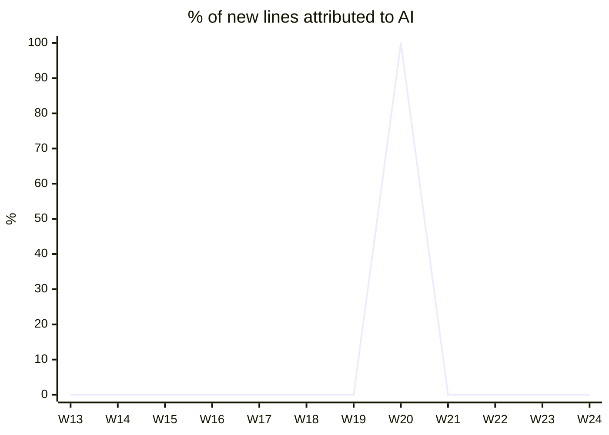
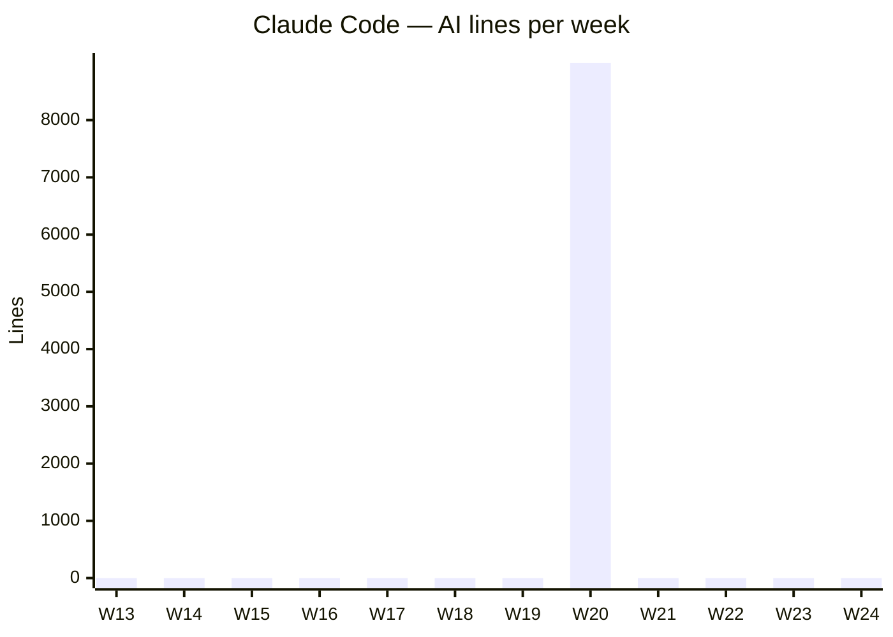
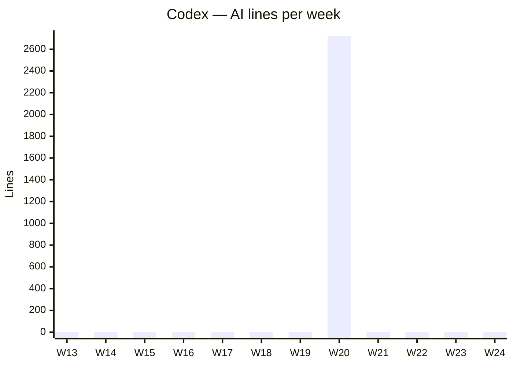
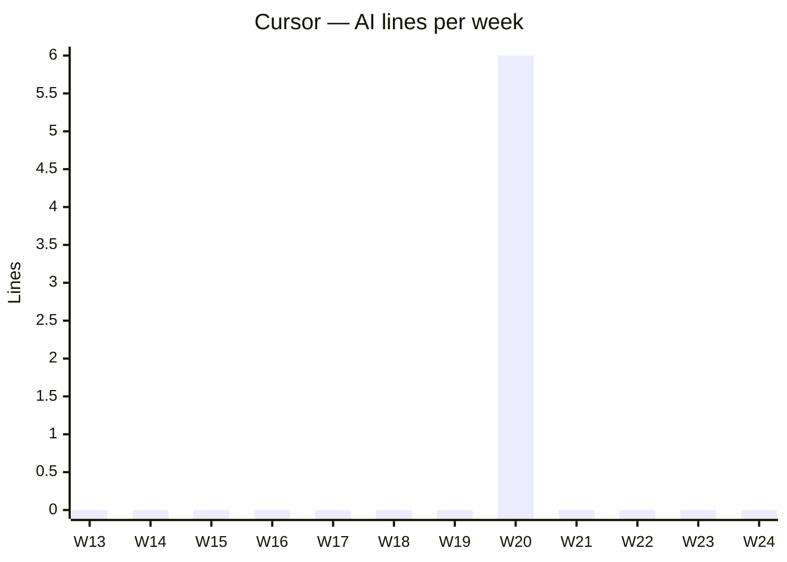

# AI Usage

<!-- ai-use:dashboard -->
_Last updated: 2026-06-08 10:17 UTC_

## At a glance

| | |
|---|---|
| **AI share this week** | **0%** &nbsp; → 0 pts vs last week |
| **AI lines this week** | 0 of 0 added |
| **AI lines last 12 weeks** | 11,724 |
| **Active tools this week** | — |

## AI share over time

## By tool over time

### Claude Code

### Codex

### Cursor

---
Auto-generated by AI PR Attribution. Hashes only — no source code is stored.
