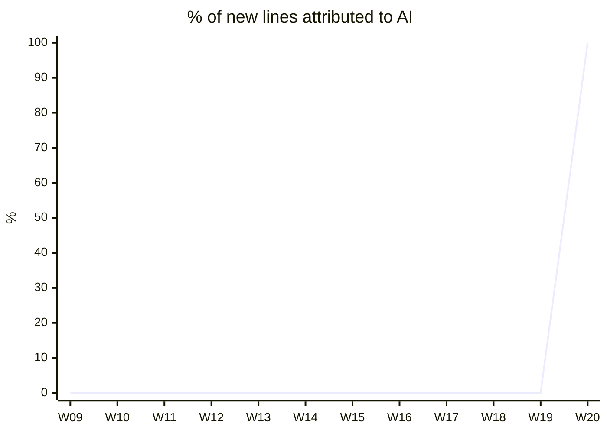
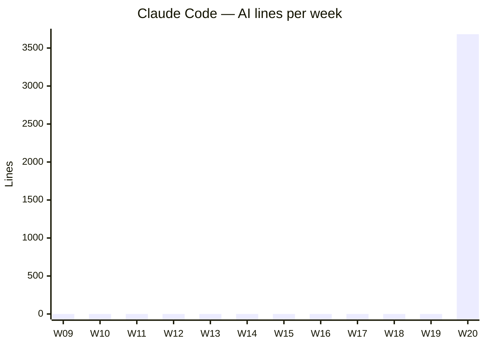
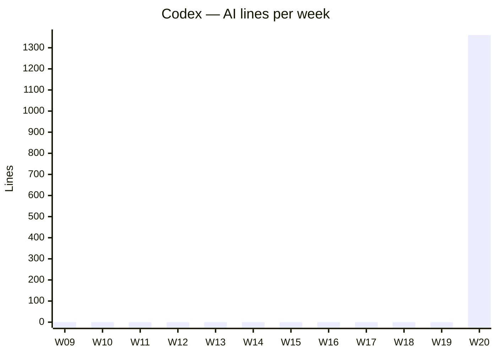
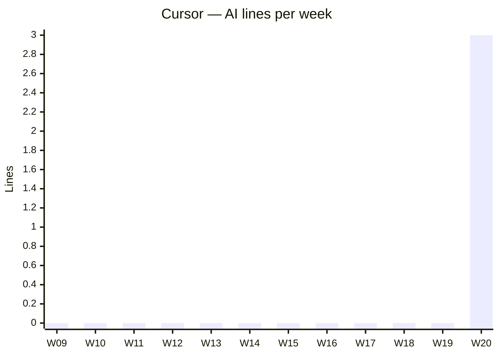

# AI Usage

<!-- ai-pr-attribution:dashboard -->
_Last updated: 2026-05-12 16:21 UTC_

## At a glance

| | |
|---|---|
| **AI share this week** | **100%** &nbsp; ↑ 100 pts vs last week |
| **AI lines this week** | 5,045 of 5,016 added |
| **AI lines last 12 weeks** | 5,045 |
| **Active tools this week** | Claude Code, Codex, Cursor |

## AI share over time

## By tool over time

### Claude Code

### Codex

### Cursor

## This week by tool

| Tool | Lines | Share |
|---|---:|---:|
| Claude Code | 3,682 | 73% |
| Codex | 1,360 | 27% |
| Cursor | 3 | 0% |

---
Auto-generated by AI PR Attribution. Hashes only — no source code is stored.
