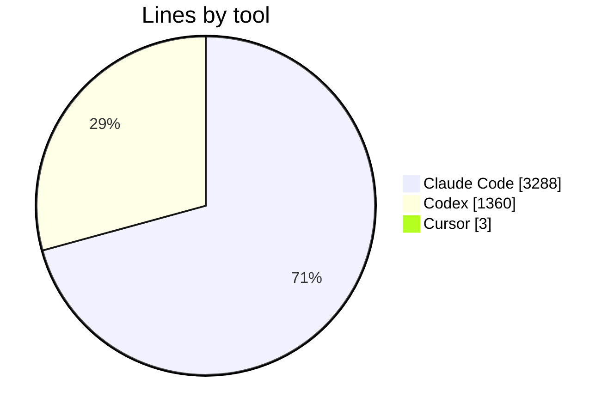
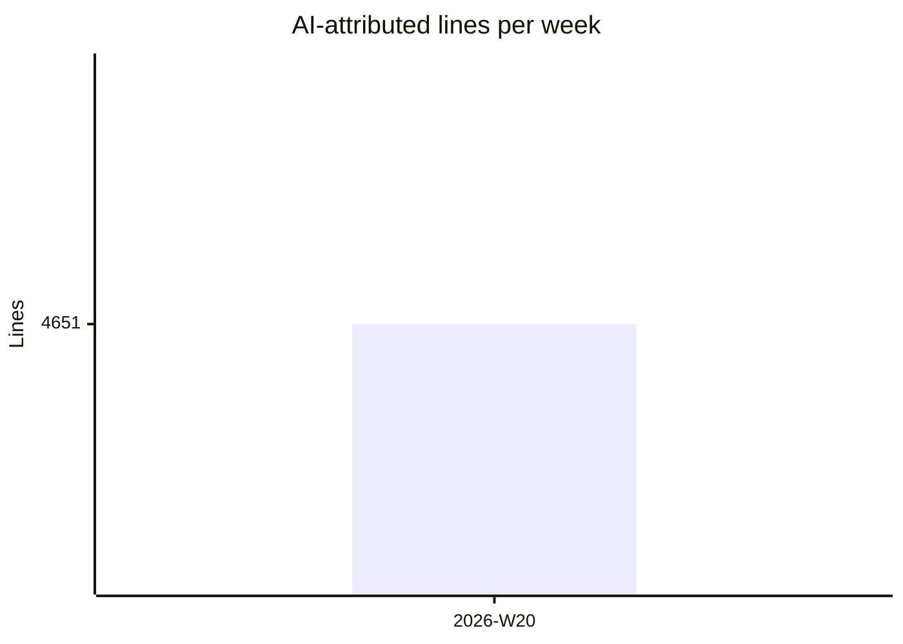

# AI PR Attribution — project overview

<!-- ai-pr-attribution:dashboard -->
_Last updated: 2026-05-12 16:15 UTC_

**4,651** AI-attributed lines across **256** events.

## By tool

| Tool | Lines | Share |
|---|---:|---:|
| Claude Code | 3,288 | 71% |
| Codex | 1,360 | 29% |
| Cursor | 3 | 0% |

## Trend — last 12 weeks

## Top files

| File | AI lines |
|---|---:|
| `/Users/ilia.savin/Documents/New project 2/src/ai_pr_attribution/dashboard.py` | 851 |
| `src/ai_pr_attribution/cli.py` | 644 |
| `README.md` | 486 |
| `src/ai_pr_attribution/github_native.py` | 322 |
| `tests/test_e2e.py` | 231 |
| `tests/test_report.py` | 204 |
| `tests/test_github.py` | 183 |
| `src/ai_pr_attribution/dashboard_markdown.py` | 164 |
| `src/ai_pr_attribution/report.py` | 117 |
| `/Users/ilia.savin/Documents/New project 2/src/ai_pr_attribution/installer.py` | 117 |

---
This page is auto-generated by the AI PR Attribution workflow. Hashes only — no source code is stored.
